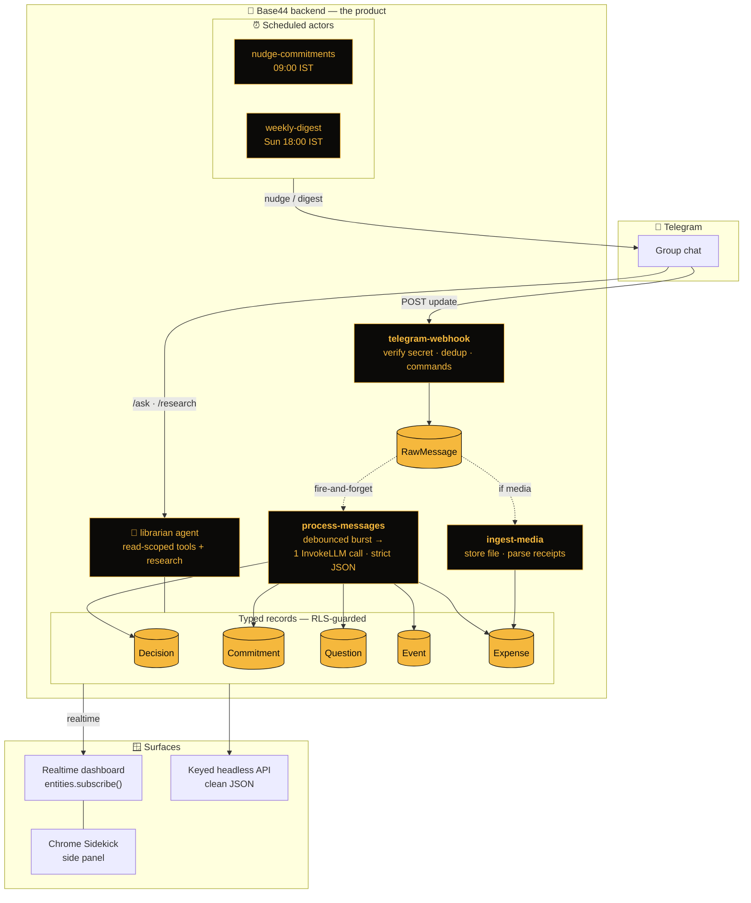
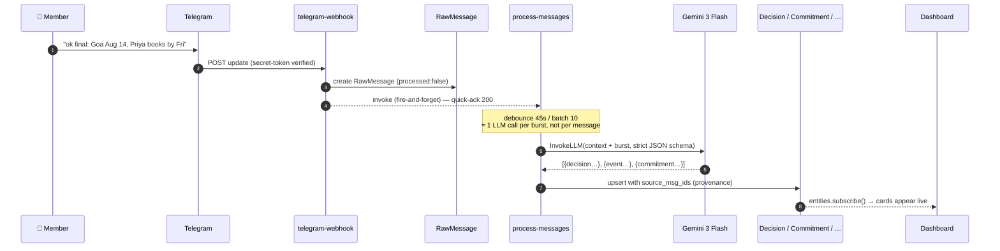
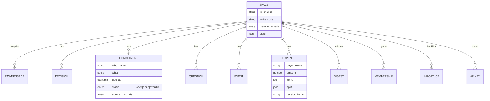

<div align="center">

# 🐝 Hivemind

### Your group chat, compiled.

**Add one bot to a Telegram group. Nobody changes how they chat.**
Hivemind silently **compiles conversation into a live database** — decisions made, commitments owed, questions unanswered, events planned, expenses split — then *acts* on it: nudges people who owe things, answers *“what did we decide?”* with receipts, settles debates with live internet research, and mails a weekly digest with an AI-painted group portrait.

<br/>

[](https://hivemind-6aebd8e4.base44.app)
[](https://base44.com)
[](#)

<br/>


**[▶ Open the live app](https://hivemind-6aebd8e4.base44.app)  ·  [Landing](https://hivemind-6aebd8e4.base44.app/landing.html)  ·  [API docs](docs/API.md)  ·  [Setup](SETUP.md)**

</div>

> [!NOTE]
> Hivemind is **not a chatbot**. Chatbots answer when spoken to. Hivemind is an event-driven **compiler**:
> `webhook → extraction pipeline → typed entities → realtime fan-out → scheduled actors → permission-scoped agent`.
> The frontend is thin on purpose — **the backend is the product.**

---

## 🎬 See it in 15 seconds

<!-- GIF SLOT ① — record the live split-screen: type the message in Telegram (left) while cards pop on the dashboard (right). Save to docs/gifs/compile.gif -->


> **Real example.** In a trip-planning group, someone types:
> > *“ok final: Goa Aug 14, budget ₹40k, Priya books flights by Friday.”*
>
> Nobody wrote anything down. Yet within seconds the dashboard grows a **Decision** (*Goa · Aug 14 · ₹40k*), an **Event** (*Goa · Aug 14*), and a **Commitment** (*Priya → book flights · due Fri*). Friday morning, the bot nudges Priya in the group. 🍯

---

## 🗺️ Architecture



### How a single message becomes a record



---

## 🔐 Data model & row-level security

Every record is scoped to a **Space** (one Telegram group). Reads are member-only; **all writes are service-role only** — the dashboard can never mutate data directly.



| Guardrail | How it works |
|---|---|
| **Member-only reads** | Every entity's RLS: `{ "member_emails": "{{user.email}}" }` — `member_emails` is denormalized onto every child record (RLS can't join across entities; [`bind-space`](base44/functions/bind-space/entry.ts) owns the fan-out). |
| **Service-role-only writes** | `create/update/delete: false` on all entities — only backend functions write. |
| **Field-level privacy** | Telegram user ids are field-restricted to admins. |
| **Provenance** | Every extraction carries `source_msg_ids`; the board deep-links **`sources ↗`** back to the exact Telegram message (`t.me/c/…`). |

---

## 🪟 Surfaces — one brain, many doors

| Surface | What | Code |
|---|---|---|
| 📊 **Realtime dashboard** | 8 live tabs (Board · Live feed · Ledger · Digest · Ask · Import · API · owner-only Engine Room) via `entities.subscribe()` | [`src/App.jsx`](src/App.jsx) |
| 🤖 **Telegram bot** | `/ask · /research · /done · /digest` + silent capture | [`telegram-webhook`](base44/functions/telegram-webhook/entry.ts) |
| 🧩 **Chrome Sidekick** | MV3 side-panel pinning the feed beside any tab (`?panel=1` chrome-less mode) | [`extension/`](extension/) |
| 🔌 **Headless API** | Keyed read API: `decisions·commitments·expenses·events·ledger` as clean JSON | [`api`](base44/functions/api/entry.ts) · [`docs/API.md`](docs/API.md) |
| 🌐 **Landing page** | Self-contained Three.js / GSAP page, OG social cards | [`landing.html`](landing.html) |
| 📱 **Installable PWA** | manifest + service worker; works to ≤480px | [`public/manifest.json`](public/manifest.json) |

<!-- GIF SLOT ② — Chrome Sidekick side panel opening beside a webpage. docs/gifs/sidekick.gif -->
<!-- GIF SLOT ③ — Import: pick result.json → progress bar fills → cards land. docs/gifs/import.gif -->

**📥 Import a year of chat in one minute.** The bot only remembers from when it joins — the **Import** tab backfills the *past*: export from Telegram Desktop (**⋮ → Export chat history → JSON, media off**), drop `result.json` in, and every text message replays through the *same* compiler. An `ImportJob` entity streams `done/total` over realtime, so the progress bar is literally `entities.ImportJob.subscribe()`. ([`import-history`](base44/functions/import-history/entry.ts) · [`ImportPanel.jsx`](src/components/ImportPanel.jsx))

---

## 🧱 Every Base44 capability, load-bearing

| Capability | Where it does real work |
|---|---|
| **Entities / DB** | 11 schemas ([`base44/entities/`](base44/entities/)) — Mongo-style queries (`$in`, `$gte`) across the pipeline |
| **Row + field-level security** | RLS block in every schema; denormalized `member_emails` |
| **Realtime** | Board + Live feed are pure `entities.subscribe()` — the demo *is* realtime |
| **Backend functions** | 13 Deno functions ([`base44/functions/`](base44/functions/)) |
| **AI / LLM** | Structured extraction on **Gemini 3 Flash** (cheap) + librarian answers on **Claude Sonnet 4.6** + `add_context_from_internet` research |
| **AI agent** | [`librarian.jsonc`](base44/agents/librarian.jsonc) — least-privilege entity tools + research function |
| **File & media storage** | `UploadPrivateFile` + signed URLs; receipts → `ExtractDataFromUploadedFile` → auto-split Expense ([`get-signed-url`](base44/functions/get-signed-url/entry.ts)) |
| **Email** | `SendEmail` weekly digests |
| **Auth** | Base44 auth + membership enforced in functions and RLS |
| **Typed SDK** | `base44 types generate` → [`base44/.types/types.d.ts`](base44/.types/types.d.ts) augments `@base44/sdk`; the client consumes it ([`base44Client.js`](src/api/base44Client.js)) |
| **Hosting** | This SPA + `/landing.html`, on Base44 hosting |

---

## 📈 Instrumented + observable

Every pipeline completion emits a best-effort **analytics event** (`analytics.track`, each wrapped in try/catch so telemetry can *never* break the pipeline):

| Event | Fired by | Properties |
|---|---|---|
| `compile_burst` | `process-messages` | `extracted`, `skipped` |
| `ask_answered` | `ask` | `space_id`, `via` |
| `research_run` | `research` | `space_id`, `sources` |
| `nudge_sent` | `nudge-commitments` | `count` |
| `digest_sent` | `weekly-digest` | `space_id` |
| `receipt_parsed` | `ingest-media` | `space_id`, `amount` |

Space **owners** get an **Engine Room** tab (gated on `Membership.role === "owner"`): a terminal-style, auto-refreshing tail of `appLogs.fetchLogs()` + a rolling-counter row — *watch the backend work.* ([`EngineRoom.jsx`](src/components/EngineRoom.jsx))

<!-- GIF SLOT ④ — Engine Room live app-log tail. docs/gifs/engine-room.gif -->

---

## 🧰 Built with

<div align="center">

| Runtime | AI | Frontend | Surfaces |
|:--:|:--:|:--:|:--:|
|  |  |  |  |
|  |  |  |  |

</div>

> **Roadmap (branches `ws-e` / `ws-h`, not yet shipped):**   

---

## ⚙️ The Workflows migration — an honesty note

This app runs on Base44's **Workflows** runtime, which disables the *legacy `automations`* declarations this codebase originally shipped (entity-triggered + cron functions). Rather than fake it, the pipeline was ported cleanly:

- **Entity triggers → explicit invocation.** [`telegram-webhook`](base44/functions/telegram-webhook/entry.ts) fire-and-forgets `process-messages` / `ingest-media` right after creating a `RawMessage` (keeps the webhook a quick-ack).
- **Cron jobs → scheduled Workflows.** The 5-min sweeper, daily nudge, and weekly digest run as dashboard Workflows calling the same functions.

---

## 🧭 Design notes & honest tradeoffs

- **Credit discipline.** Extraction runs on a cheap model, ~1 call per conversation *burst* (45 s debounce + 5-min sweeper), not per message. The strong model is reserved for explicit `/ask`.
- **RLS by denormalization.** `member_emails` is mirrored onto child records because RLS can't join across entities — a documented, scale-appropriate tradeoff.
- **Provenance over trust.** Every extraction carries `source_msg_ids`; answers come with receipts and hallucinated “memories” are cheap to audit.
- **v1 scope.** Edited/deleted Telegram messages and voice transcription are noted extension points, not silent gaps.

---

## 🚀 Quickstart

```bash
# Prereqs: Node 20+, a Telegram bot (@BotFather → /newbot → token; /setprivacy → DISABLE)
git clone https://github.com/Sushant6095/hivemind && cd hivemind
npm install

base44 login
echo "VITE_BASE44_APP_ID=<your-app-id>" > .env
base44 entities push && base44 functions deploy && base44 agents push

base44 secrets set TELEGRAM_BOT_TOKEN=…  TG_WEBHOOK_SECRET=$(openssl rand -hex 16) \
                   SEED_DEMO_KEY=$(openssl rand -hex 8)  APP_PUBLIC_URL=https://<app>.base44.app
WEBHOOK_URL=<telegram-webhook fn URL> ./scripts/set-webhook.sh

npm run build && base44 site deploy
```

> ⚠️ **BotFather `/setprivacy` must be OFF** — otherwise the bot can’t see group messages at all.

Full walkthrough → **[SETUP.md](SETUP.md)**.

---

## 📁 Repo layout

```
base44/
  entities/     11 JSON schemas with RLS blocks
  functions/    13 Deno functions (entry.ts + function.jsonc)
  agents/       librarian.jsonc
src/            React dashboard (Vite) — 8 live panels, dark hive theme, PWA
extension/      Chrome MV3 "Sidekick" side-panel
docs/           API.md · gifs/
landing.html    self-contained Three.js/GSAP landing (also served at /landing.html)
scripts/        bootstrap · set-webhook · push-to-github
```

## 🔒 Privacy

Groups opt in by adding the bot. Media lives in private storage behind short-lived signed URLs. Dashboard access requires login **and** membership; row-level security means even a valid login sees only their own spaces. Telegram user ids are field-level hidden from non-admins.

<div align="center">
<br/>

**[▶ Open the live app](https://hivemind-6aebd8e4.base44.app)**

<sub>Built solo for the Base44 Dev Build-Off 2026, with AI pair-programming. 🐝</sub>

</div>
